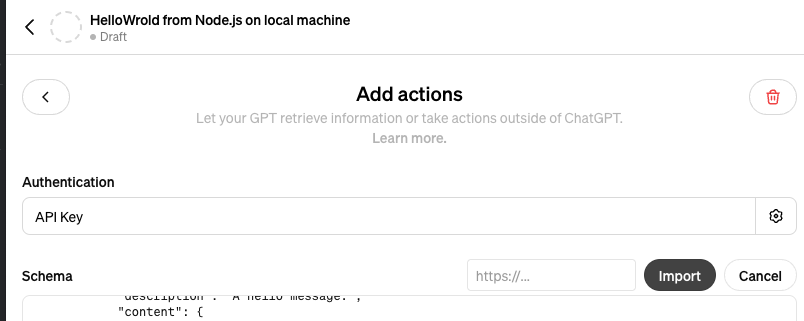
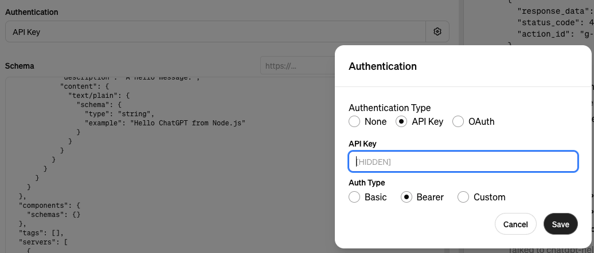

# Node.js Server Boilerplate for CustomGPT Actions

This project provides a Node.js server boilerplate designed to facilitate the development and exposure of server APIs for CustomGPT actions in ChatGPT. It incorporates essential tools and libraries to streamline setup, development, and integration, making it ideal for both local development and external demonstrations.

## Features

- **Express.js**: Utilizes Express to manage routing and server setup, providing a robust foundation for web server functionality.
- **Inquirer.js**: Offers an interactive command line user interface to assist in project setup and configuration.
- **LocalTunnel**: Allows the local development server to be exposed to the internet, enabling real-time testing and sharing without deployment.
- **Swagger-JSDoc**: Automatically generates and serves OpenAPI specifications from code comments, facilitating easy API documentation management and integration with ChatGPT.
- **Basic Bearer Authentication**: Implements basic bearer token authentication to secure endpoints.

## Getting Started

### Prerequisites

Ensure you have Node.js installed on your machine. If not, download and install it from [Node.js official website](https://nodejs.org/).

### Installation

Clone the repository to your local machine:

```bash
git clone https://github.com/wonderwhy-er/custom-chatgpt-actions-server-boilerplate.git
cd ChatGPTCustomActionNodejsBoilerplate
```

Install the necessary dependencies:

```bash
npm install
```

### Running the Server

To start the server, run:

```bash
npm start
```

On the first run when config was not yet created
It will ask in terminal things to configure server for you
Thins such as:
1. Server Port
2. To use LocalTunnel or not
3. Domain name for local tunnel or production server
4. It also generate auth token

Then it will start the server.
This command will start LocalTunnel and provide you with a public URL when LocalTunnel is set to true in Config

## Adding to CustomGPT

1. On your url this server will expose:
{your url domain}/openapi.json

2. Add it to your custom gpt actions import field


3. Add auth token from config.json to custom gpt auth field


And you should be good to go

## Adding new actions

1. Create new file in /api folder
2. Add an endpoint for it in serverModules/apiRoutes
3. implement everything in new api file, don't forget to generate openapi jsdoc comment, you can ask ChatGPT for that

## Contributing

Contributions are welcome! Please fork the repository and submit pull requests with your features or fixes.

## License

This project is licensed under the MIT License - see the LICENSE file for details.
